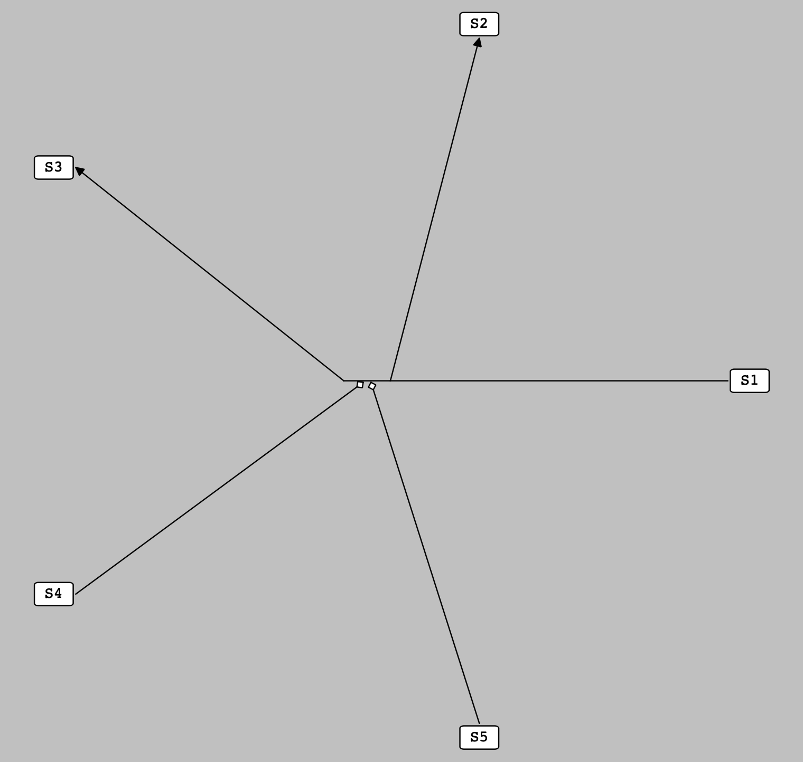
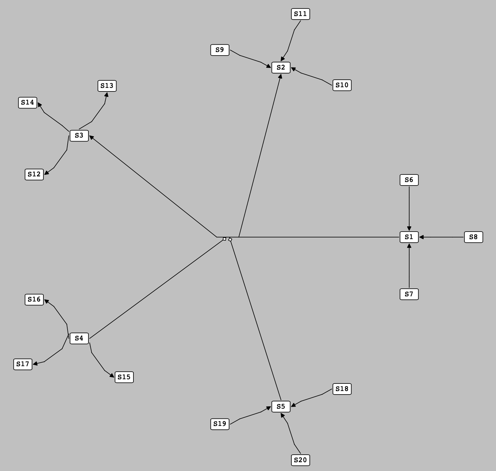
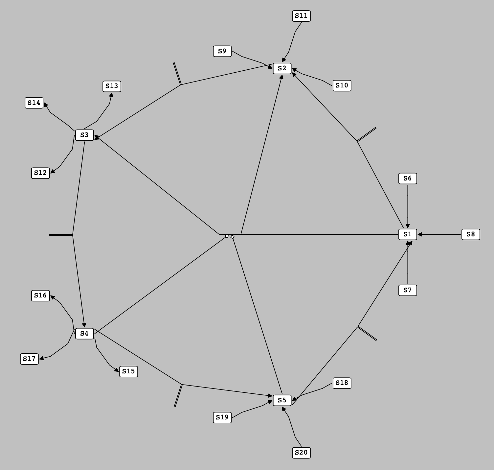
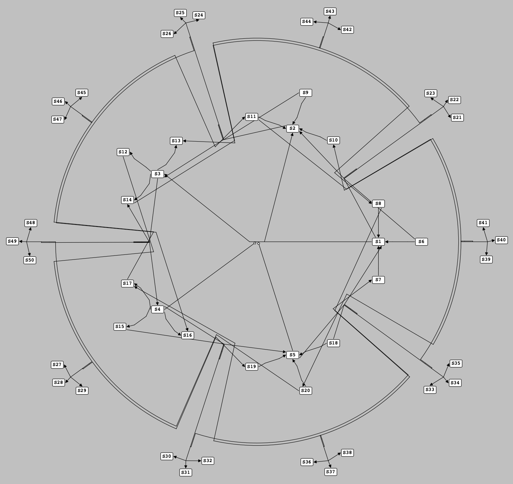
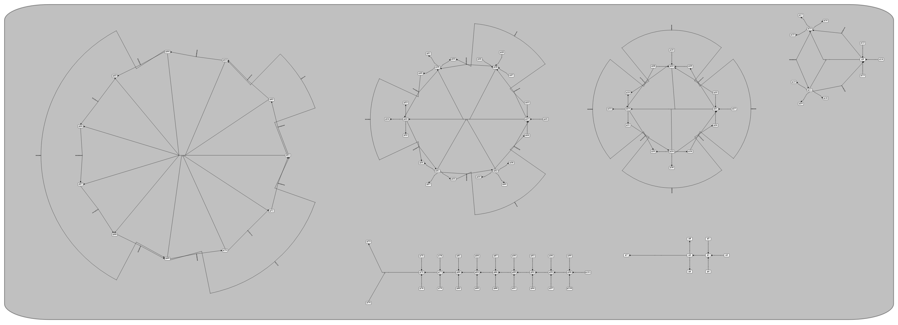

******************
Auto-Layout/Render
******************

As a number of SBML models do not contain Layout and Render information, automatically generating all the necessary information about the Layout and Render extensions for an SBML model is one of the main features of SBNE. Here, we have both integrated `Graphviz <https://graphviz.org/>`_ algorithms and **developed a novel auto-layout algorithm** to set the position and dimensions of each graphical object in the network of an SBML model (Layout features) and determined the default values for other graphical features of each type of graphical object in that network (Render features).

Auto-Layout
###########

In SBNE, the auto-layout algorithm, which is implemented by :ref:`APIReference/functions/LayoutInfo/ne_li_addLayoutFeaturesToNetowrk:ne_li_addLayoutFeaturesToNetowrk`, is a tool to set the position and dimensions of each graphical object in the network of an SBML model, including :ref:`Compartments <APIReference/classes/layout/NCompartment:NCompartment>`, :ref:`Species <APIReference/classes/layout/NSpecies:NSpecies>`, :ref:`Reactions <APIReference/classes/layout/NReaction:NReaction>`, :ref:`SpeciesReferences <APIReference/classes/layout/NSpeciesReference:NSpeciesReference>`, and :ref:`Texts <APIReference/classes/layout/NText:NText>`. SBNE makes use of eihter of the following algorithms to set these values:

a) Graphviz layout algorithms
=============================

If you :ref:`Build <installation:Build from Source>` SBNE with enabled ``USE_GRAPHVIZ`` option or :ref:`install <installation:Download SBNE binaries>` it using its precompiled binaries, `Graphviz <https://graphviz.org/>`_ libraries are integrated into SBNE. Graphviz is an open source graph visualization software tool which represents structural information as diagrams of abstract graphs and networks. By integrating it into SBNE, `Graphviz layout algorithms <https://graphviz.org/about/>`_ are used to automatically set the position and dimensions of each graphical object in the network of an SBML model.

b) The novel layout algorithm
=============================

If you :ref:`Build <installation:Build from Source>` SBNE with disabled ``USE_GRAPHVIZ`` option, it uses the new algorithm we have developed here to to set the position and dimensions of each graphical object in the network of an SBML model. This algorithm is described in detail in the following:

Basic idea
----------

The network of an SBML model consists of compartments, reactions, species (nodes), and speciesreferences (edges). We consider that, in each compartment, there are some clusters of reactions with the following features:

- No two clusters share a mutual species with one another.

- The reaction with the highest number of species in each cluster is considered to be the **main-reaction** of that cluster and other reactions are the **sub-reactions** which are connected to it through their mutual species.

With this in mind, the whole problem of setting the position of the graphical objects in a network is reduced to:

- Locating main-reactions,

- Locating the species of each main-reaction,

- Locating the sub-reactions connected to each main-reaction,

- Locating the species of each sub-reaction,

- Packing clusters of reactions into a compartment,

respectively. We have developed a number of heuristics to set the position and dimensions of each graphical object, accordingly.

Steps
-----

Clustering reactions
^^^^^^^^^^^^^^^^^^^^

First, we determine the clusters of reactions. Reactions which share a mutual species fall into the same cluster, and the one with the highest number of species is considered to be the main-reaction of that cluster. Sub-reactions of a cluster are sorted so that the ones which are directly connected to the main-reaction through one (or more) mutual species come before the ones which are connected to the main-reaction through one (or more) intermediate sub-reaction(s).

To locate the reactions of each cluster, we first imagine the center of each cluster is located at the origin of our coordinate system. Later, once all the reactions and species of the clusters are located, we move the clusters relatively so that we can find the best position for each one.

Locating main-reactions
^^^^^^^^^^^^^^^^^^^^^^^

In each cluster, the center of the main reaction is considered to be at the same place where the center of the cluster it belongs to is located. Once the main reaction is located, all its species are evenly distributed around it on a circular basis as shown in the following figure:

    The species of a main reaction are evenly distributed around it on a circular basis.

Locating sub-reactions with One pre-located species
^^^^^^^^^^^^^^^^^^^^^^^^^^^^^^^^^^^^^^^^^^^^^^^^^^^

At this stage, the sub-reactions with only one species whose position is set in the previous stages are located. Here, the center of a sub-reaction is placed at one of the sides of its pre-located species on the line either along the one connecting the pre-located species to the center of the main reaction or perpendicular to it. Once a sub-reaction is located, its non-located species are evenly distributed around it on a circular basis as shown in the following figure:

    .. note::

        For the purpose of simplicity, all the located sub-reactions shown in the following figure have one non-located species. It is not a general rule, and there is no limitation to the number of the non-located species a sub-reaction can have at this stage.
        
    .. note::
    
        At this stage, each pre-located species has three unoccupied sides, so up to three sub-reactions can be located around it. If we have more than three sub-reactions which contain one particular pre-located species, the extra sub-reaction(s) is(are) located later according to the following heuristic.

    Sub-reactions with one pre-located species are located at the side of their pre-located species.
    
Locating sub-reactions with More-Than-One pre-located species
^^^^^^^^^^^^^^^^^^^^^^^^^^^^^^^^^^^^^^^^^^^^^^^^^^^^^^^^^^^^^

Here, we defined the concept of **pseudospecies**, a term for a hypothetical species which works as a proxy for one or more than one species. A pseudospecies is located on the circumference of a circle with an arbitrary radius and centered on the center of the main reaction. The angle of a pseudospecies on this circle is determined by averaging over the angles of the species it represents (the angle of each species is calculated using the reference direction, a horizontal line passing through the center of the main reaction).

Accordingly, to locate the position of a sub-reaction which contains more than one pre-located species, we first create a pseudospecies as a representative for its pre-located species and then, like previous stage, we locate the sub-reaction at one of the sides of this pseudospecies. Finally, the non-located species of the sub-reaction are evenly distributed around it on a circular basis as shown in the following figure:

    .. note::

        For the purpose of simplicity, all the located sub-reactions shown in the following figure have only two species (which are both pre-located). It is not a general rule, and there is no upper limitation to the number of the pre-located and non-located species a sub-reaction can have at this stage.

    Sub-reactions with more than one pre-located species are located at the side of the pseudospecies representing their pre-located species.

Reaction Layers and Vacancies
^^^^^^^^^^^^^^^^^^^^^^^^^^^^^

As mentioned in the previous stage, one of the features of our auto-layout algorithm is creating pseudospecies to represent one or more than one pre-located species. As the number of required pseudospecies in a cluster of reactions grows, finding an appropriate position to locate pseudospecies gains crucial importance in optimally positioning the elements of a network.

In this regard, we introduced the concept of layers and their vacancies for each reaction in a cluster. The **layers** of a reaction are some concentric circles centered on the center of that reaction and radiuses with values starting from the distance between the center and the pre-located species of that reaction and increasing stepwise per each layer. The **vacancies** of each layer are the arcs made by dividing the circumference of that layer into equally-sized sections, with total number twice the number of the species of the reaction.

Now, by establishing layers and vacancies for the reactions of a cluster, the following rules are followed to locate the position of each pseudospecies through filling the vacancies:

- The species of each reaction fill the vacancies of the first layer of that reaction.
- Reactions which are positioned at the side of a species do not fill the vacancies of the reaction that species belongs to.
- Reactions which are positioned at the side of a species fill the vacancies of the reaction to which the reaction that species belongs to is connected (and the vacancies of the reactions to which the intermediate reaction is connected, and so on).
- Pseudospecies representing pre-located species all of which belong to one reaction fill vacancies of both that reaction and the main reaction of the cluster.
- Pseudospecies representing pre-located species from different reactions only fill the vacancies of the main reaction of the cluster.
- Pseudospecies created to locate the additional (more than three) reactions among the sub-reactions with one particular pre-located species only fill vacancies of the main reaction of the cluster.
- Vacancies for pseudospecies are chosen to be as close as possible to a place in the middle of the pre-located species they represent.
- pseudospecies are positioned at the center of the vacancy to which they are assigned.

By taking into account these rules, it is possible to neatly locate reactions and their species in a cluster of reactions. The following figure shows an example in which a set of reactions are placed in such a cluster:

    A set of reactions are located at the side of the pseudospecies which have filled the vacancies in the layers of the reactions containing the pre-located species they are representing.

Packing clusters into a compartment
^^^^^^^^^^^^^^^^^^^^^^^^^^^^^^^^^^^

By iterating the previous steps, we can determine the positions of all the reactions of each cluster and their associated species. As we mentioned earlier, here we need to move the clusters of reactions relatively to find their exact positions in a compartment. This process is very similar to a "Packing Problem", through which a bunch of small rectangles are packed into a bigger one with definite dimensions. Here, we define an extent box for each cluster of reactions (a box surrounding all the reactions and species in a cluster) and then try to pack these extent boxes into a rectangle with minimum size (representing the compartment to which they belong). By doing so, the position of each cluster and its constituents is determined as shown in the following figure for a set of clusters of reactions:

    Locating each cluster of reactions in its exact position by packing them into their containing compartment.

Auto-Render
###########

The auto-render algorithm, which is implemented by :ref:`APIReference/functions/RenderInfo/ne_ri_addDefaultRenderFeaturesToVeneer:ne_ri_addDefaultRenderFeaturesToVeneer`, is a tool to set the default values for the graphical features of graphical objects in a network of an SBML model, including :ref:`Colors <APIReference/classes/render/VColorDefinition:VColorDefinition>`, :ref:`Gradients <APIReference/classes/render/VGradientBase:VGradientBase>`, :ref:`Line Endings <APIReference/classes/render/VLineEnding:VLineEnding>` and :ref:`Styles <APIReference/classes/render/VGlobalStyle:VGlobalStyle>`.

Default Render Values
=====================

Our auto-render algorithm sets the following default values for graphical features of an SBML model:

Colors
------

A series of colors are added to the :ref:`Veneer <APIReference/classes/render/Veneer:Veneer>` of the network. The added colors are:

.. list-table::
    :widths: 100 100 3000
    :header-rows: 1
    :align: center

    * - .. centered:: Name
      - .. centered:: Hex
      - .. centered:: Color

    * - White
      - #ffffff
      - .. raw:: html
      
            <embed>
                

            </embed>
          
    * - Black
      - #000000
      - .. raw:: html
      
            <embed>
                

            </embed>
            
    * - Red
      - #ff0000
      - .. raw:: html
      
            <embed>
                

            </embed>
    
    * - DarkRed
      - #800000
      - .. raw:: html
      
            <embed>
                

            </embed>
        
    * - Green
      - #00ff00
      - .. raw:: html
      
            <embed>
                

            </embed>
    
    * - DarkGreen
      - #008000
      - .. raw:: html
      
            <embed>
                

            </embed>
            
    * - Blue
      - #0000ff
      - .. raw:: html
    
            <embed>
              

            </embed>
            
    * - DarkBlue
      - #000080
      - .. raw:: html
    
            <embed>
              

            </embed>
    
    * - Cyan
      - #00ffff
      - .. raw:: html
      
            <embed>
              

            </embed>
    
    * - DarkCyan
      - #008080
      - .. raw:: html
      
            <embed>
              

            </embed>
    
    * - Magenta
      - #ff00ff
      - .. raw:: html
      
            <embed>
              

            </embed>
    
    * - DarkMagenta
      - #800080
      - .. raw:: html
      
            <embed>
              

            </embed>
    
    * - Gray
      - #a0a0a4
      - .. raw:: html
      
            <embed>
              

            </embed>
    
    * - DarkGray
      - #808080
      - .. raw:: html
      
            <embed>
              

            </embed>
    
    * - LightGray
      - #c0c0c0
      - .. raw:: html
      
            <embed>
              

            </embed>

Background Color
----------------

The background color of the network scene is set to **LightGray**.

Line Endings
------------

:ref:`Line Endings <APIReference/classes/render/VLineEnding:VLineEnding>` are the geometric shapes put at the start/end head of the curves (:ref:`SpeciesReferences <APIReference/classes/layout/NSpeciesReference:NSpeciesReference>`) in a network to show the role of the species they are connected to in reactions. Thus, for each species role in reactions, a Line Ending is defined as follows and added to the :ref:`Veneer <APIReference/classes/render/Veneer:Veneer>` of the network:

.. list-table::
    :widths: 100 100 200
    :header-rows: 1
    :align: center
    
    * - .. centered:: Role
      - .. centered:: Name
      - .. centered:: Line Ending

    * - Product
      - productHead
      - .. figure:: images/13.png
              :width: 100
              :alt: Alternative text
              :align: center
    * - Side Product
      - sideProductHead
      - .. figure:: images/14.png
              :width: 100
              :alt: Alternative text
              :align: center
    * - Modifier
      - modifierHead
      - .. figure:: images/15.png
              :width: 100
              :alt: Alternative text
              :align: center
    * - Activator
      - activatorHead
      - .. figure:: images/16.png
              :width: 100
              :alt: Alternative text
              :align: center
    * - Inhibitor
      - inhibitorHead
      - .. figure:: images/17.png
              :width: 100
              :alt: Alternative text
              :align: center

Styles
------

:ref:`Styles <APIReference/classes/render/VGlobalStyle:VGlobalStyle>` are used to determine how a graphical object is rendered in a network based on either its type or its role in reactions. Thus, both for each type of graphical objects and for each role in reactions, a Style with the following features is defined and added to the :ref:`Veneer <APIReference/classes/render/Veneer:Veneer>` of the network.

- Features of the Styles for different **types** of graphical objects:

.. list-table::
    :widths: 50 50 50 50 50 50 50 50 50
    :header-rows: 1
    :align: center

    * - .. centered:: Feature
      - .. centered:: COMPARTMENTGLYPH
      - .. centered:: SPECIESGLYPH
      - .. centered:: REACTIONGLYPH
      - .. centered:: SPECIESREFERENCEGLYPH
      - .. centered:: TEXTGLYPH
      - .. centered:: GENERALGLYPH
      - .. centered:: GRAPHICALOBJECT
      - .. centered:: ANY
      
    * - **stroke**
      - DarkGray
      - Black
      - Black
      - Black
      - Black
      - Black
      - Black
      - Black
      
    * - **stroke-width**
      - 8.0
      - 2.0
      - 2.0
      - 2.0
      - 2.0
      - 2.0
      - 2.0
      - 2.0
      
    * - **fill**
      - LightGray
      - White
      - White
      - White
      - White
      - White
      - White
      - White
      
    * - **font-family**
      - monospace
      - monospace
      - monospace
      - monospace
      - monospace
      - monospace
      - monospace
      - monospace
      
    * - **font-size**
      - 24 %0
      - 24 %0
      - 24 %0
      - 24 %0
      - 24 %0
      - 24 %0
      - 24 %0
      - 24 %0
      
    * - **font-weight**
      - normal
      - normal
      - normal
      - normal
      - normal
      - normal
      - normal
      - normal
      
    * - **font-style**
      - normal
      - normal
      - normal
      - normal
      - normal
      - normal
      - normal
      - normal

    * - **text-anchor**
      - middle
      - middle
      - middle
      - middle
      - middle
      - middle
      - middle
      - middle

    * - **vtext-anchor**
      - middle
      - middle
      - middle
      - middle
      - middle
      - middle
      - middle
      - middle
      
    * - **geometric shape**
      - Rectangle (rounded)
      - Rectangle (rounded)
      - Ellipse (circle)
      - _
      - _
      - _
      - _
      - _
      
    * - **startHead**
      - _
      - _
      - _
      - _
      - _
      - _
      - _
      - _
      
    * - **endHead**
      - _
      - _
      - _
      - _
      - _
      - _
      - _
      - _
      

- Features of the Styles for different **roles** in a reaction:
    
.. list-table::
    :widths: 50 50 50 50 50 50 50 50
    :header-rows: 1
    :align: center

    * - .. centered:: Feature
      - .. centered:: substrate
      - .. centered:: side substrate
      - .. centered:: product
      - .. centered:: side product
      - .. centered:: modifier
      - .. centered:: activator
      - .. centered:: inhibitor
      
    * - **stroke**
      - Black
      - Black
      - Black
      - Black
      - Black
      - Black
      - Black
      
    * - **stroke-width**
      - 2.0
      - 2.0
      - 2.0
      - 2.0
      - 2.0
      - 2.0
      - 2.0
      
    * - **fill**
      - White
      - White
      - White
      - White
      - White
      - White
      - White
      
    * - **font-family**
      - monospace
      - monospace
      - monospace
      - monospace
      - monospace
      - monospace
      - monospace
      
    * - **font-size**
      - 24 %0
      - 24 %0
      - 24 %0
      - 24 %0
      - 24 %0
      - 24 %0
      - 24 %0
      
    * - **font-weight**
      - normal
      - normal
      - normal
      - normal
      - normal
      - normal
      - normal
      
    * - **font-style**
      - normal
      - normal
      - normal
      - normal
      - normal
      - normal
      - normal

    * - **text-anchor**
      - middle
      - middle
      - middle
      - middle
      - middle
      - middle
      - middle

    * - **vtext-anchor**
      - middle
      - middle
      - middle
      - middle
      - middle
      - middle
      - middle
      
    * - **geometric shape**
      - _
      - _
      - _
      - _
      - _
      - _
      - _
      
    * - **startHead**
      - _
      - _
      - _
      - _
      - _
      - _
      - _
      
    * - **endHead**
      - _
      - _
      - productHead
      - sideProductHead
      - modifierHead
      - activatorHead
      - inhibitorHead

