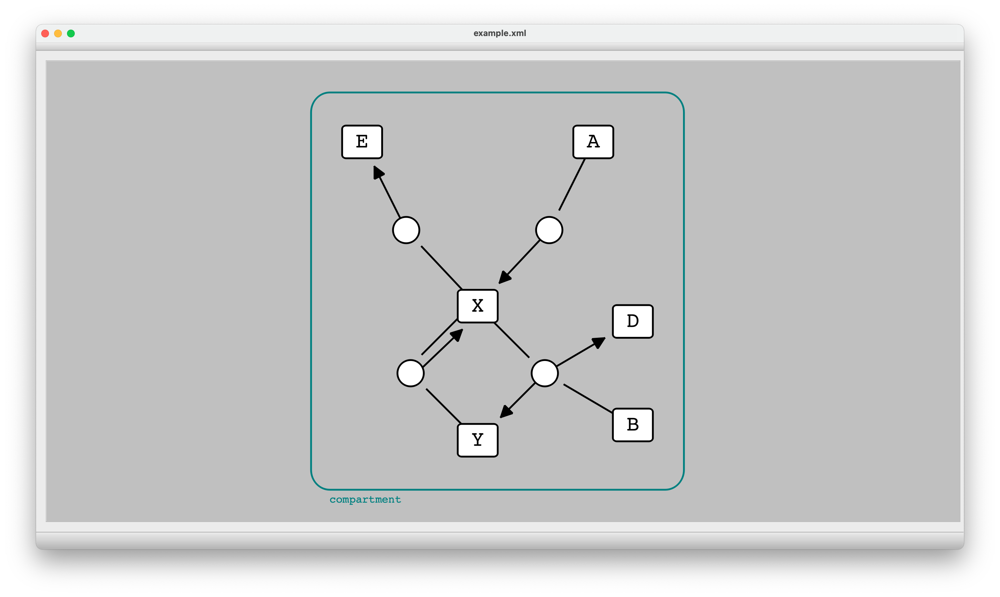

***********
Quick Start
***********

Using portable C++ library (C++ API)
####################################

To use the portable C++ library, called libSBNE, you first need to:

* Either :ref:`Build <installation:Build from Source>` libSBML and libSBNE from source,
* Or Install SBNE (C++ API component) using its :ref:`precompiled binaries <installation:Download SBNE binaries>`.

Then:

*  Add SBNE include directory (``<SBNE install directory>/include``) to the "include directory" of your project.
*  Add libSBNE library (in ``<SBNE install directory>/lib`` for Unix and in ``<SBNE install directory>/bin`` for Windows) to the "dependencies" of your project.
* Include the following headers in your script:

    .. code-block:: C++

        #include "sbne/sbml/ne_sbml.h"
        #include "sbne/sbml/ne_layout.h"
        #include "sbne/sbml/ne_render.h"
    
Now you are able to make use of the functions of the API in your code. Here are two examples of it:

C++ example#1 (add layout and render features)
==============================================

This example is a simple script which makes use of the API to read the SBML document of an SBML (.xml) file, add Layout and Render features (if not included) to it, and write back the document to the SBML file.

.. code-block:: C++

    #include "sbne/sbml/ne_sbml.h"
    #include "sbne/sbml/ne_layout.h"
    #include "sbne/sbml/ne_render.h"

    using namespace sbne;

    int main () {
        // set inputfile value to the absolute path of the input SBML (.xml) file.
        const std::string inputfile = "Absolute path to the input sbml (.xml) file";
        
        // set outputfile value to the absolute path of the output SBML (.xml) file.
        const std::string outputfile = "Absolute path to the output sbml (.xml) file";

        // read the inputfile and get its SBML document
        SBMLDocument* document = ne_doc_readSBML(inputfile);

        //get layout information (if exists) from the SBML document
        LayoutInfo* li = ne_doc_processLayoutInfo(document);

        // get render information (if exists) from the SBML document
        RenderInfo* ri = ne_doc_processRenderInfo(document);

        // if layout information does not exist
        if (!ne_net_isLayoutSpecified(ne_li_getNetwork(li))) {
            // apply autolayout algorithm
            ne_li_addLayoutFeaturesToNetowrk(li);
        }

        // if render information does not exist
        if (!ne_ven_isRenderSpecified(ne_ri_getVeneer(ri))) {
            // apply autorender algorithm
            ne_ri_addDefaultRenderFeaturesToVeneer(ri);
        }

        // add newly-added or already-included layout information to the SBML document
        document = ne_doc_populateSBMLdocWithLayoutInfo(document, li);
        
        // add newly-added or already-included render information to the SBML document
        document = ne_doc_populateSBMLdocWithRenderInfo(document, ri);

        // write the SBML document to the outputfile
        ne_doc_writeSBML(document, outputfile);
    }

C++ example#2 (change layout and render features)
=================================================

This example shows how to use :ref:`APIReference/functions/ne_get:ne_get` and :ref:`APIReference/functions/ne_set:ne_set` functions of the API to read the SBML document of an SBML (.xml) file, make a change to the Layout or Render features of it, and write back the document to the SBML file.

.. code-block:: C++

    #include "sbne/ne_core.h"

    using namespace sbne;

    int main () {
        
        // set filename value to the absolute path of the SBML (.xml) file.
        const std::string filename = "Absolute path to the sbml (.xml) file";
        
        // set elementid value to the id of a network element.
        const std::string elementid = "Id of a network element";
        
        // set color value to a desired color for the element.
        const std::string color = "Desired color for the element";
        
        // create an infolist which is used by set function to set the stroke color of a network element
        std::unordered_map<std::string, std::string> infolistset({
            {"filename", filename},
            {"id",elementid},
            {"stroke",color}
            });
        
        // create an infolist which is used by get function to get the stroke color of a network element
        std::unordered_map<std::string, std::string> infolistget({
            {"filename", filename},
            {"id",elementid},
            {"key","stroke"}
            });
        
        // set the stroke color of the network element
        if (!ne_set(infolistset))
            std::cout << "The desired value is set\n";
        else
            std::cout << "Failed to set the desired value\n";
        
        // get the stroke color of the network element
        std::string value = ne_get(infolistget);
        if (!value.empty())
            std::cout << "The desired value is: " << value << "\n";
        else
            std::cout << "Failed to get the desired value\n";
    }

Using Python bindings
#####################

To use the language bindings of SBNE for Python, you first need to:

* Either :ref:`pip install the python package <installation:Install Python package>`,
* :ref:`Build <installation:Build from Source>` libSBML and SBNE (with enabled ``WITH_PYTHON`` option) from source,
* Or install SBNE (Python Bindings component) using its :ref:`precompiled binaries <installation:Download SBNE binaries>`.

Then:

* In case you pip installed the python package or enabled ``PYTHON_INSTALL_WITH_SETUP`` option while building SBNE from source,

    * ``import libsbne`` in your script.
    
* In case you either enabled ``PYTHON_INSTALL_IN_PREFIX`` option while building SBNE from source or installed SBNE using its binaries,

    * Add the directory of the built Python library (``<SBNE install directory>/lib/pyhton[version]/site-packages/libsbne``) to your ``PYTHONPATH``.
    * ``import _libsbne`` in your script.

Now, you can make use of the functions of the API in your Python script. Here we have provided two examples of it:

Python example#1 (add layout and render features)
=================================================

Here is a simple script which makes use of the Python bindings of the API to read the SBML document of an SBML (.xml) file, add Layout and Render features (if not included) to it, and write back the document to the SBML file.

.. code-block:: Python

    import libsbne as sbne

    # set inputfile value to the absolute path of the input SBML (.xml) file.
    inputfile = "Absolute path to the input sbml (.xml) file"

    # set outputfile value to the absolute path of the output SBML (.xml) file.
    outputfile = "Absolute path to the output sbml (.xml) file"

    # read the inputfile and get its SBML document
    document = sbne.ne_doc_readSBML(inputfile)

    # get layout information (if exists) from the SBML document
    layoutinfo = sbne.ne_doc_processLayoutInfo(document)

    # get render information (if exists) from the SBML document
    renderinfo = sbne.ne_doc_processRenderInfo(document)

    # if layout information does not exist
    if not sbne.ne_net_isLayoutSpecified(sbne.ne_li_getNetwork(layoutinfo)):
        # apply autolayout algorithm
        sbne.ne_li_addLayoutFeaturesToNetowrk(layoutinfo)

    # if render information does not exist
    if not sbne.ne_ven_isRenderSpecified(sbne.ne_ri_getVeneer(renderinfo)):
        # apply autorender algorithm
        sbne.ne_ri_addDefaultRenderFeaturesToVeneer(renderinfo)

    # add newly-added or already-included layout information to the SBML document
    document = sbne.ne_doc_populateSBMLdocWithLayoutInfo(document, layoutinfo)

    # add newly-added or already-included render information to the SBML document
    document = sbne.ne_doc_populateSBMLdocWithRenderInfo(document, renderinfo)

    # write the SBML document to the outputfile
    sbne.ne_doc_writeSBML(document, outputfile)

Python example#2 (change layout and render features)
====================================================

This example shows how to use :ref:`APIReference/functions/ne_get:ne_get` and :ref:`APIReference/functions/ne_set:ne_set` functions of the Python bindings of the API to read the SBML document of an SBML (.xml) file, make a change to the Layout or Render features of it, and write back the document to the SBML file.

.. code-block:: Python

    import libsbne as sbne

    # set filename value to the absolute path of the SBML (.xml) file.
    filename = "Absolute path to the sbml (.xml) file"

    # set elementid value to the id of a network element.
    elementid = "Id of a network element"

    # set color value to a desired color for the element.
    color = "Desired color for the element"

    # create an infolist which is used by set function to set the stroke color of a network element
    infolistset = {'filename': filename,
                  'id': elementid,
                  'stroke': color}

    # create an infolist which is used by get function to get the stroke color of a network element
    infolistget = {'filename': filename,
                  'id': elementid,
                  'key': 'stroke'}
                  
    # set the stroke color of the network element
    if not sbne.ne_set(infolistset):
        print("The desired value is set")
    else:
        print("Failed to set the desired value")

    # get the stroke color of the network element
    value = sbne.ne_get(infolistget)
    if value:
        print("The desired value is: ", value)
    else:
        print("Failed to get the desired value")
        
.. note::

    As shown in the above C++/Python example#2, both :ref:`APIReference/functions/ne_get:ne_get` and :ref:`APIReference/functions/ne_set:ne_set` functions have an *unsoreted_map (in C++)/dictionary (in Python)* input argument which contains the required information to get/set the value of an element of the network. To initialize a variable and use it as this argument, the following **key:value** pairs are used:
    
        .. list-table::
            :widths: 100 300
            :header-rows: 1
            :align: left

            * - .. centered:: Key
              - .. centered:: Value

            * - .. centered:: "filename"
              - The absolute path of the SBML (.xml) file
              
            * - .. centered:: "id"
              - The id of a network element (like a :ref:`APIReference/classes/layout/NSpecies:NSpecies`, :ref:`APIReference/classes/render/VGlobalStyle:VGlobalStyle`, etc.)
              
            * - .. centered:: "geometricshape"
              - The id/shape of a :ref:`APIReference/classes/render/VTransformation2D:VTransformation2D` element of a :ref:`APIReference/classes/render/VRenderGroup:VRenderGroup`
              
            * - .. centered:: "stopid"
              - The id of a :ref:`APIReference/classes/render/VGradientStop:VGradientStop` of a :ref:`APIReference/classes/render/VGradientBase:VGradientBase`
              
            * - .. centered:: "index"
              - The index of an element of a network element (like :ref:`APIReference/classes/layout/LCurve:LCurve`, :ref:`APIReference/classes/render/VPolygon:VPolygon`, etc.)
              
            * - .. centered:: "point"
              - The type of a point (like "point", "renderpoint", "basepoint1", etc.)
              
            * - .. centered:: "key"
              - The attribute of the network element to get (like "x", "stroke", and etc.)
              
            * - .. centered:: "[attribute]"
              - The value of the [attribute] of the network element to be set

Using SBNE-GUI (Graphical User Interface)
#########################################

To use the graphical user interface of SBNE, you first need to:

* Either :ref:`Build <installation:Build from Source>` libSBML and libSBNE (with enabled ``WITH_GUI`` option) from source,
* Or install SBNE (SBNE-GUI component) using its :ref:`precompiled binaries <installation:Download SBNE binaries>`.

Then, go to ``<SBNE install directory>/bin``:

* On Microsoft Windows and macOS, double-click on SBNE-GUI executable.
* On Linux, run ``./SBNE-GUI`` command.

GUI example
===========

Here is a simple example to show how to:

* Read the SBML document of an SBML (.xml) file.
* Add Layout and Render features (if not included) to it.
* Render a biological network for the SBML model using its Layout and Render information.
* Make a change to the network of the model.
* Write the modified SBML document to an SBML file and save it.
 
To do so, once we run SBNE-GUI, we need to load an SBML file. Here, we click on "File" in the menu bar, and then click on the "Open" action.

    
    Loading an SBML file into the GUI.

Using the popped-up file dialog, we choose an SBML (*example.xml*) file and open it. This action reads the SBML document in the file, (if not included) generates the Layout and Render information for the model, and renders the network of the model using this information.

    Rendered network of the SBML model.

Now, to become able to modify the features of the rendered network, we need to **double-click on the graphical item whose features we want to change**. Once it is done, a feature menu enabling us to make changes to that graphical item pops up at the left side of the GUI screen (here, we have double-clicked on the Species named *X*, so a features menu for "Species" has appeared).

.. note::

    To close this menu, we can simply double-click on an empty zone within the graphics scene of the GUI.

    Getting access to the featrues menu for "Species".

As an example, here we want to change the *fill color* of the graphical item representing the *X* species. So, from the tab menu, we first choose the **Render** tab, and then, under the **Fill** section of the "Style", we click on the **color picker button**, which enables us to choose a new color. Here, we can choose our desired color ("red"):

    Choosing a new fill color using **color picker button**.

After we chose our desired color, the *fill color* of the graphical item representing the *X* species turns into the chosen color.

 
    Modified network of the SBML model (the *fill color* of the graphical item representing the *X* species has turned into "red").

To write the modified features to the existing SBML model file and save it, we click on "File" in the menu bar, and then click on the "Save" action. Using the popped-up file dialog, we can choose a name and directory for the SBML (.xml) file and save it. The GUI also allows us to export the drawing of the rendered network in PDF format by clicking on the "Export as PDF" action under the "File" menu bar.

    Saving the modified SBML model and exporting a drawing of its rendered network as a PDF file.
